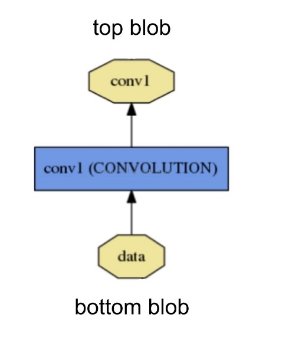

# Layer

Layer是caffe的基础和基本计算单元 Caffe十分强调网络的层次性。可以说 一个网络的大部分功能都是以Layer的形式展开的 如 conv, pooling, loss等 
在创建一个caffe模型的时候 也是以layer为基础进行的 需按照src/caffe/proto/caffe.proto中定义的网络及参数格式定义网络prototxt文件 

layer 与 blob 的关系


其protobuff定义如下，一个layer有一个到多个的top和bottom，其对应于blob
```
layer {  
      name: "conv1"  
      type: "Convolution"  
      bottom: "data"  
      top: "conv1"  
     ....  
    }  
``` 

## 每一层定义了三种操作

- Setup：Layer的初始化
- Forward：前向传导计算，根据bottom计算top，调用了Forward_cpu（必须实现）和Forward_gpu（可选，若未实现，则调用cpu的）
- Backward：反向传导计算，根据top计算bottom的梯度，其他同上


## 派生类分类
在Layer的派生类中，主要可以分为Vision Layers

#### Vision Layers
Vison 层主要用于处理视觉图像相关的层，以图像作为输入，产生其他的图像。其主要特点是具有空间结构。
包含Convolution(conv_layer.hpp)、Pooling(pooling_layer.hpp)、Local Response Normalization(LRN)(lrn_layer.hpp)、im2col等，注：老版本的Caffe有头文件include/caffe/vision_layers.hpp，新版本中用include/caffe/layer/conv_layer.hpp等取代

#### Loss Layers
这些层产生loss
如Softmax(SoftmaxWithLoss)、Sum-of-Squares / Euclidean(EuclideanLoss)、Hinge / Margin(HingeLoss)、Sigmoid Cross-Entropy(SigmoidCrossEntropyLoss)、Infogain(InfogainLoss)、Accuracy and Top-k等

#### Activation / Neuron Layers
元素级别的运算，运算均为同址计算（in-place computation，返回值覆盖原值而占用新的内存）。
如：ReLU / Rectified-Linear and Leaky-ReLU(ReLU)、Sigmoid(Sigmoid)、TanH / Hyperbolic Tangent(TanH)、Absolute Value(AbsVal)、Power(Power)、BNLL(BNLL)等

#### Data Layers
网络的最底层，主要实现数据格式的转换
如：Database(Data)、In-Memory(MemoryData)、HDF5 Input(HDF5Data)、HDF5 Output(HDF5Output)、Images(ImageData)、Windows(WindowData)、Dummy(DummyData)等


#### Common Layers

Caffe提供了单个层与多个层的连接。如：Inner Product(InnerProduct)、Splitting(Split)、Flattening(Flatten)、Reshape(Reshape)、Concatenation(Concat)、Slicing(Slice)、Elementwise(Eltwise)、Argmax(ArgMax)、Softmax(Softmax)、Mean-Variance Normalization(MVN)等
