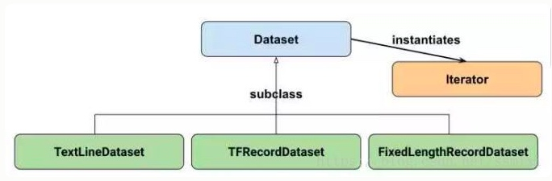

# 读取数据方式
- placehold feed_dict: 从内存中读取 
- queue队列： 从硬盘中读取 
- Dataset： 同时支持内存和硬盘读取数据 


<br>
## placehold-feed_dict 

先用placehold占位数据，在graph中读取数据 数据直接内嵌到Graph中 然后当Graph传入Session是，用feed_dict喂补数据 当数据量比较大的时候，graph的传输会遇到效率低下问题，特别是数据转换。 

## queue队列
如果我们的数据读取算法没有进行多线程设计的话（即单线程），又有读取数据和处理数据在同一个进程是有先后关系的，意味着数据处理完后必须花时间读取数据。然后才能进行计算处理。大大减低了效率，queue创建多进程彻底解决了这个问题。

tf使用两个线程（文件名队列和内存队列）分别执行数据读入和数据计算。文件名队列源源不断的将硬盘中的图片数据放入内存， 内存队列负责给GPU送数据，所需数据直接从内存队列中获取。

总结
> 通过一系列的Tensor操作，将磁盘上的数据分批次读入并送入模型进行使用。这种方法效率很高，但因为其牵涉到Tensor操作，不够直观，也不方便调试，所有有时候会显得比较困难。


<br>
## tf.data.Dataset 



```python
def _parse_function(filename, label):
    image_string = tf.read_file(filename)
    image_decoded = tf.image.decode_image(image_string)
    image_resized = tf.image.resize_images(image_decoded,(28,28))
return image_resized, label

filenames = tf.constants(["/var/data/image1.jpg",...])
labels = tf.constans([0,30,...])

dataset = tf.data.Dataset.from_tensor_slices((filenames, labels))
# 将filenames读入 并缩放为28*28大小 
dataset = dataset.map(_parse_function) 

image_resized_batch((32, 28, 28, 3), label_batch(32,))
# 重复10次等于10个epoch
dataset = dataset.shuffle(buffer_size=1000).batch(32).repeat(10)

```