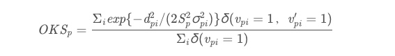

# 精确度评估

## OKS影响因素
1. 预测点和标注点的欧式距离
    1. 与精确度成正比

2. 对象大小
    1. 与精确度成反比
    2. 在同等欧式距离的情况下，对象越大结果越精确  

3. 不同部位（与标注有关）
    1. 人工标注位置与真实位置偏移不一样 
    2. 以人为例，因为人的肩部、臀部的偏移量往往比眼睛、鼻子多，因为人的肩部、臀部可标注的地方比人的眼睛、鼻子大。
    3. 人工标注位置的偏移度$\sigma$与最后的OKS得分成反比
    4. 人体部位的sigma值： `sigmas = np.array([.26, .25, .25, .35, .35, .79, .79, .72, .72, .62, .62, 1.07, 1.07, .87, .87, .89, .89]) / 10.0`
    
        `'nose', 'l_eye', 'r_eye', 'l_ear', 'r_ear', 'l_shoulder',
        'r_shoulder', 'l_elbow', 'r_elbow', 'l_wrist', 'r_wrist',
        'l_hip', 'r_hip', 'l_knee', 'r_knee', 'l_ankle', 'r_ankle'` 
        
            标注部位越准确（范围越小）， sigma值越小。           

    1. 猪体部位的sigma值：
        1. 强调某一个点，可以考虑减小它的sigma值

        sigmas = np.array([.35, .35, 1， 1， 1， 1，
        .87, .87, .87, .87, .87, .87, .3,
        .87, .87, .87, .87, .87, .87, 1.]) / 10.0
        NAMES = ['左耳','右耳','后颈中心','脊背前点','脊背中点','脊背尾点',
        '左后髋关节','左后膝关节','左后踝关节','左前踝关节','左前膝关节','左前髋关节','外阴部',
        '右后踝关节','右后膝关节','右后髋关节','右前髋关节','右前膝关节','右前踝关节','腹部中心']
     

## OKS公式 

 

## 平均准确率（AP）
平均准确率（AP）给定OKS阈值s，预测的结果在整个测试集上的平均准确率（AP@s）（AP@s）可由测试集中所有图片的OKS指标计算得到:
$AP@_s=Σpδ(OKSp>s)\ /\ Σ_p1$

 
 

## 平均准确率（AP）的均值(mAP)
最终指标mAP的计算方式如下所示：
mAP=mean{AP@(0.50:0.05:0.95)}
从给定阈值0.5到0.95按照0.05步长递计算AP后，再取平均值。
