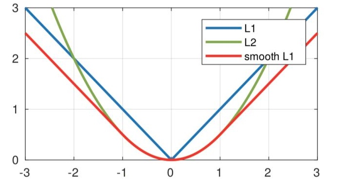
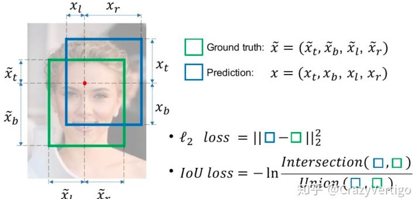
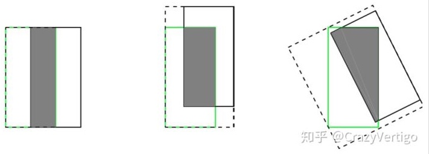
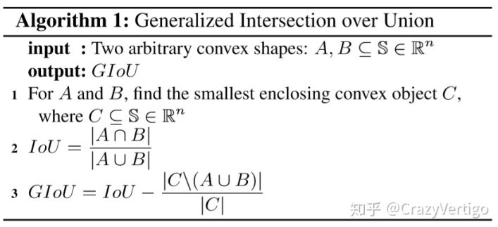
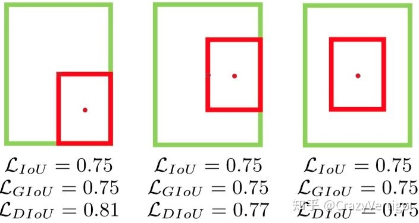
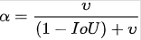
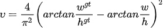
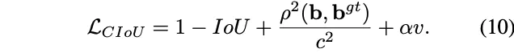

# 目标检测损失函数

## Smooth L1 Loss
L1 = 2x
L2 = $x^2$
$$smooth_{L1}(x) = 
\begin{cases}
0.5x^2& \text{|x|<1}\\
1& \text{otherwise}
\end{cases}$$

从损失函数对x的导数可知： L1损失函数对x的导数为常数，在训练后期，x很小时，如果learning rate 不变，损失函数会在稳定值附近波动，很难收敛到更高的精度。 L2损失函数对x的导数在x值很大时，其导数也非常大，在训练初期不稳定。$smooth_{L1}$完美的避开了这些缺点。

**缺点：**

上面的三种Loss用于计算目标检测的Bounding Box Loss时，独立的求出4个点的Loss，然后进行相加得到最终的Bounding Box Loss，这种做法的假设是4个点是相互独立的，实际是有一定相关性的
实际评价框检测的指标是使用IOU，这两者是不等价的，多个检测框可能有相同大小的[公式]Loss，但IOU可能差异很大，为了解决这个问题就引入了IOU LOSS。

 

## IoU Loss

通过4个坐标点独立回归Building boxes的缺点：

- 检测评价的方式是使用IoU,而实际回归坐标框的时候是使用4个坐标点，如下图所示，是不等价的；L1或者L2 Loss相同的框，其IoU 不是唯一的
- 通过4个点回归坐标框的方式是假设4个坐标点是相互独立的，没有考虑其相关性，实际4个坐标点具有一定的相关性
- 基于L1和L2的距离的loss对于尺度不具有不变性

基于此提出IoU Loss,其将4个点构成的box看成一个整体进行回归

 

## Generalized GIoU Loss
IoU Loss 有2个缺点：

当预测框和目标框不相交时，IoU(A,B)=0时，不能反映A,B距离的远近，此时损失函数不可导，==IoU Loss 无法优化两个框不相交的情况==。
假设预测框和目标框的大小都确定，只要两个框的相交值是确定的，其IoU值是相同时，==IoU值不能反映两个框是如何相交的==。

如上图所示，三种不同相对位置的框拥有相同的IoU=0.33值，但是拥有不同的GIoU=0.33，0.24，-0.1。当框的对齐方向更好一些时GIoU的值会更高一些

C为包围预测框$B$ $B^{gt}$的最小区域大小

 

## Distance DIoU

当目标框完全包裹预测框的时候，IoU和GIoU的值都一样，此时GIoU退化为IoU, 无法区分其相对位置关系；此时作者提出的DIoU因为加入了中心点归一化距离，所以可以更好地优化此类问题。

基于IoU和GIoU存在的问题，作者提出了两个问题：
- 第一：直接最小化预测框与目标框之间的归一化距离是否可行，以达到更快的收敛速度。
- 第二：如何使回归在与目标框有重叠甚至包含时更准确、更快。

通常基于IoU-based的loss可以定义为 $L = 1 - IoU +R(B, B^{gt})$ ，其中 [公式] 定义为预测框 $B$ 和目标框 $B^{gt}$ 的惩罚项。

DIoU中的惩罚项表示为$R = \frac{\rho(b, b^{gt})}{c^2}$，其中 $b, b^{gt}$ 分别表示 $B$ 的中心点， $B^{gt}$ 表示欧式距离， $c$ 表示 $B$ 和 $B^{gt}$ 的最小外界矩形的对角线距离

DIoU Loss function定义为:
$$ L_{DIoU} = 1 - IoU + \frac{\rho^2(b, b_{gt})}{c^2} $$

 

## Complete CIoU

好的目标框回归损失应该考虑三个重要的几何因素：==重叠面积，中心点距离，长宽比==
相对于GIoU Loss收敛速度更快，该Loss考虑了重叠面积和中心点距离，但没有考虑到长宽比；针对问题二，作者提出了CIoU Loss，其收敛的精度更高
CIoU的惩罚项是在DIoU的惩罚项基础上加了一个影响因子 ，这个因子把预测框长宽比拟合目标框的长宽比考虑进去。

CIoU的惩罚项是在DIoU的惩罚项基础上加了一个影响因子$\alpha \nu $

$\alpha$是用于做trade-off的参数

$\nu $用来衡量长宽比一致性的参数

