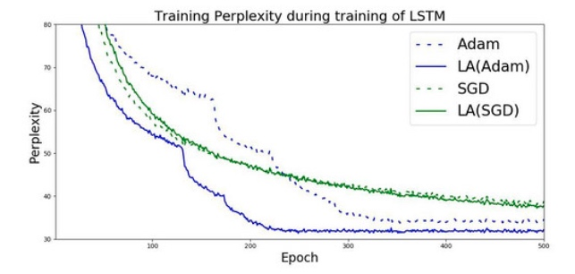
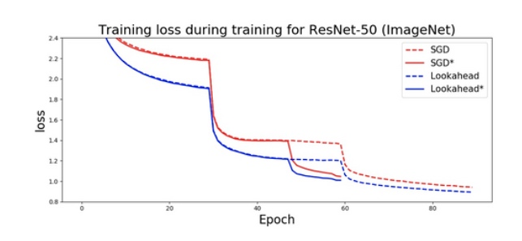

# 优化器

Ranger - a synergistic optimizer combining RAdam (Rectified Adam) and LookAhead




###       RAdam 与 LookAhead 为什么能够实现互补

RAdam 可以说是优化器在开始训练时的最佳基础。RAdam 利用动态整流器根据方差调整 Adam 的自适应动量，并有效提供能够根据当前数据集定制的自动预热机制，能够确保训练以扎实的基础顺利迈出第一步。

LookAhead 则受到深度神经网络损失面的最新理解进展启发，能够在整个训练期间提供健壮且稳定的突破。

引用 LookAhead 团队的说法——LookAhead“减少了对广泛超参数调整的需求”，同时实现了“以最小计算开销确保不同深度学习任务实现更快收敛速度。”

因此，二者都在深度学习优化的不同方面带来了突破，而且这种组合具有高度协同性，有望为大家的深度学习结果提供两项最佳改进。如此一来，通过将两项最新突破 (RAdam + LookAhead) 加以结合，Ranger 的整合成果有望为深度学习带来新的发展驱动力，帮助我们进一步追求更稳定且强大的优化方法。


### RAdam (Rectified Adam) 是什么

简单对 RAdam 作个总结：该项目的研究人员调查了自适应动量优化器（Adam、RMSProp 等）的机制，发现所有项目都需要进行预热，否则往往会在训练开始时带来糟糕的局部优化状态。

### Lookahead：探索损失面的辅助系统，带来更快且更稳定的探索与收敛效果
目前大多数成功的优化器都建立在 SGD 基础之上，同时加入：自适应动量（Adam、AdaGrad）或者一种加速形式（Nesterov 动量或者 Polyak Heavy Ball）以改善探索与训练过程，并最终收敛。

但是，Lookahead 是一种新型开发成果，其会保留两组权重而后在二者之间进行插值，从而推动更快权重集的“前瞻”或者探索，同时让较慢的权重集留在后面以维持长期稳定性。

结果就是，训练期间的方差有所降低，对次优超参数的敏感性下降，同时减少了对广泛超参数调整的需求。这种作法能够在多种深度学习任务之上实现更快收敛。





## tf code
```
import tensorflow_addons as tfa
radam = tfa.optimizers.RectifiedAdam()
ranger = tfa.optimizers.Lookahead(radam, sync_period=6, slow_step_size=0.5)
```