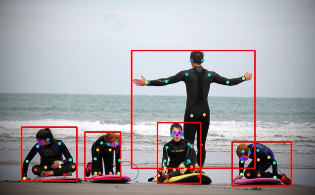

# coco 数据集获取及渲染

```python
from pycocotools.coco import COCO
img_ann = 'data/coco/annotations/person_keypoints_val2017.json'
img_dir = 'data/coco/val2017/'
coco = COCO(annotation_file=img_ann)
catIds = coco.getCatIds(catNms=['person'])
imgIds = coco.getImgIds(catIds=catIds)
img = coco.loadImgs(imgIds[24])
img_name = img[0]['file_name']
img_path = img_dir + img_name
annIds = coco.getAnnIds(imgIds=img[0]['id'], catIds=catIds, iscrowd=None)
anns = coco.loadAnns(annIds)
import matplotlib.pyplot as plt
cmap = plt.get_cmap('rainbow')
colors = [cmap(i) for i in np.linspace(0, 1, 17)]
COLORS = [(c[2] * 255, c[1] * 255, c[0] * 255) for c in colors]
def splash_coco_kps(img_path, anns):
    img = cv2.imread(img_path)
    for ann in anns:
        keypoints = ann['keypoints']
        keypoints = np.array(keypoints).reshape(17, 3)
        bbox = ann['bbox']
        x, y, w, h = list(map(int, bbox))
        img = cv2.rectangle(img, (x, y), (x+w, y+h), (0,0,255), 2)
        for i, kpt in enumerate(keypoints):
            if kpt[-1] == 0: continue
            x, y, _ = kpt
            p = (x, y)
            thickness = 3
            color = COLORS[i]
            img = cv2.circle(img,p,thickness,color,-1)
    return img
img = splash_coco_kps(img_path, anns)
cv2.imwrite('tmp.png', img)
!imgcat tmp.png
```




